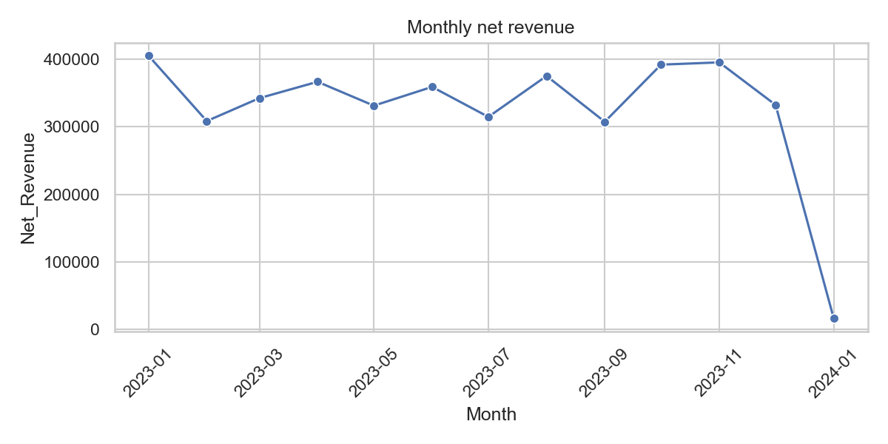
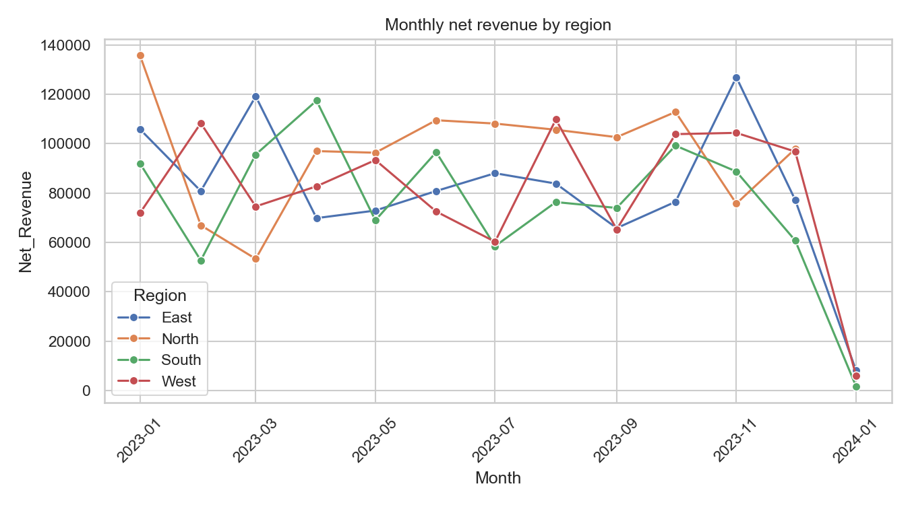
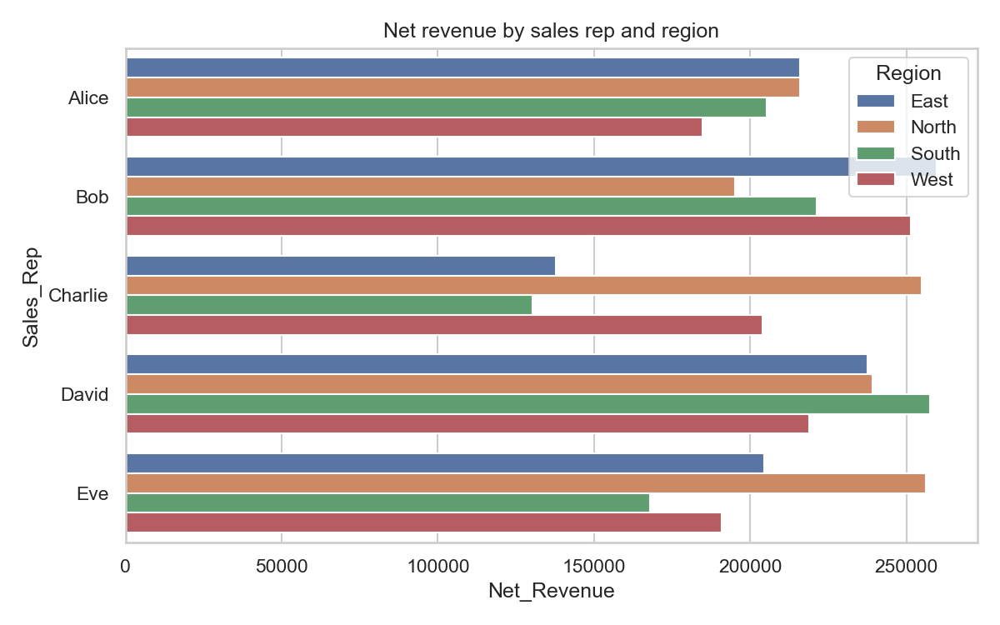
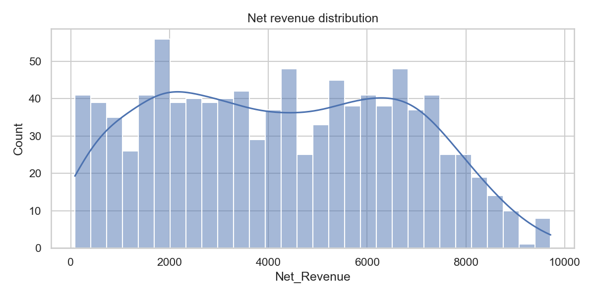

# Sales Data Mining Assignment

## Overview
This repository explores a sales dataset (`data/sales_data.csv`) to produce insights and dashboards. The workflow includes data enrichment, exploratory analysis, static and interactive visuals, and web dashboards.

## Setup
- Python deps: `python -m pip install pandas seaborn matplotlib plotly chartjs-chart-boxplot`
- Optional: use `python -m venv .venv && .\.venv\Scripts\activate` on Windows before installing.

## Data
- Dataset lives in `data/sales_data.csv` (downloaded via `download_dataset.py` if needed).
- Enriched fields: Month, Week, Net_Revenue, Gross_Margin, Net_Profit.

## How to Run
1) Notebook EDA: open `analysis.ipynb` and run all cells. Outputs go to `outputs/` and `outputs/aggregates/`.
2) Plotly dashboard: `python dashboard.py` then open `outputs/dashboard.html`.
3) Web dashboard (Chart.js + D3):
   - From repo root: `python -m http.server 8000`
   - Visit `http://localhost:8000/web_dashboard/`

## Key Findings
- Revenue peaks in January (~405k); October/November are next (~392–396k); mid-year dips.
- Region: North leads (~1.16M); East/West close (~1.05–1.06M); South trails (~0.98M).
- Reps: David (~0.95M) and Bob (~0.93M) lead; Alice/Eve (~0.82M); Charlie (~0.73M).
- Categories: Clothing (~1.10M) ≈ Electronics (~1.08M) > Furniture (~1.06M) > Food (~1.02M).
- Channels: Retail (~2.16M) slightly ahead of Online (~2.09M).
- Discounts cut into profit; effects vary by channel/customer type. Correlations show profit aligns with quantity and price; discounts pull it down.

## Outputs and Artifacts
- Aggregates: `outputs/aggregates/` (monthly, monthly-by-region, rep-region).
- Static charts: `outputs/*.png`.
- Interactive Plotly dashboard: `outputs/dashboard.html`.
- Web dashboard screenshots: `web_dashboard/dashboard_visuals/`.

## Sample Visuals

## Next Steps
- Add forecasting/anomaly flags for the January spike and mid-year dip.
- Calibrate discount guardrails by channel and customer type to protect margin.
- Package aggregates into PowerBI/Chart.js/D3 for a final course-ready dashboard.

